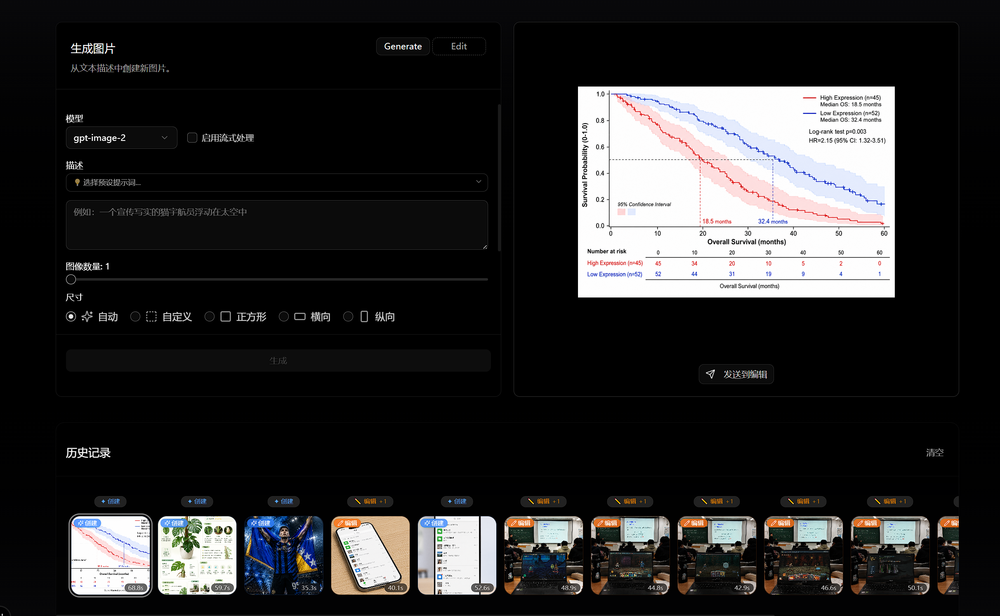
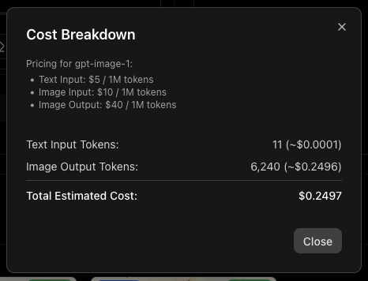
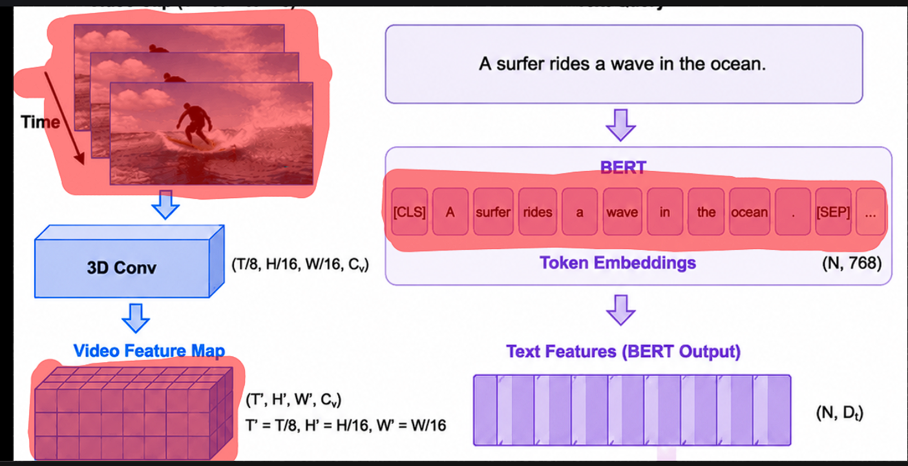
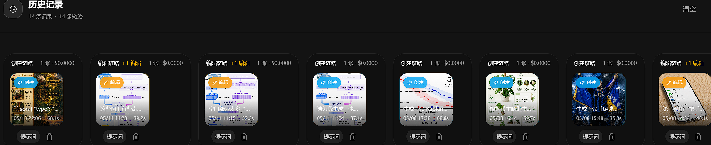

<!--
╔══════════════════════════════════════════════════════════════════════╗
║  DreamSeed 种梦计划 — AI创造者大赛  官方 README 模板                ║
║                                                                      ║
║  使用说明：                                                          ║
║  1. 将本模板放在参赛仓库根目录 README.md 的顶部                       ║
║  2. 头图使用 DreamField 官方公开活动图片地址                         ║
║  3. 请保留 DREAMFIELD_README_HEADER_START / END 标识                 ║
║  4. 分割线以下供创作者自由编写项目内容                               ║
╚══════════════════════════════════════════════════════════════════════╝
-->

<!-- DREAMFIELD_README_HEADER_START -->

<p align="center">
  <a href="https://www.dreamfield.top">
    
  </a>
</p>

<!-- DREAMFIELD_README_HEADER_END -->

<p align="right">English: [README_EN.md](README_EN.md)</p>


##  GPT 图像工坊

一个面向研究者与创作者的交互式 Web 工具，基于 OpenAI 的 GPT 图像系列模型（支持 `gpt-image-2`、`gpt-image-1.5`、`gpt-image-1` 与 `gpt-image-1-mini`），提供图像生成、基于 Mask 的编辑、流式预览与历史成本追踪功能。

<p align="center">
  <!-- Gallery: main interface + supporting screenshots -->
  
  <br/>
  
  
  
  <br/>
  
  <p style="font-size:0.95rem; color:#666; margin-top:8px;">上：主界面与关键功能预览；中：成本明细、Mask 创作与密码设置弹窗；下：历史记录面板（可重放或删除操作）。</p>
</p>

**本仓库当前分支：** feat/update-components（参考：仓库 image2 / bpluo）

**关键特性一览**

- 支持生成与编辑模式（`generate` / `edit`）。
- 流式生成与部分图像预览（Server-side SSE，客户端可显示逐步生成的预览帧）。
- 可配置模型：`gpt-image-2`（默认）、`gpt-image-1.5`、`gpt-image-1`、`gpt-image-1-mini`。
- 多种输出格式与压缩设置：`png` / `jpeg` / `webp`，支持输出压缩（当适用）。
- 学术绘图预设（`AcademicPromptPicker`）：内置多种论文级别的绘图模板与提示词。
- 内置 Mask 编辑器（绘制/上传）用于局部编辑。
- 本地历史与成本估算：每次请求记录参数、使用量与估算 USD 成本。
- 两种图像存储模式：服务器文件系统（默认）或浏览器 IndexedDB（Dexie.js，适合 Serverless 部署）。

技术栈与主要依赖：Next.js 16、React 19、TypeScript、TailwindCSS、shadcn/ui（Radix + lucide）、Dexie.js、openai 官方 SDK。

主要 API 路由（服务器端实现）：

- `POST /api/images` —— 接受表单提交（生成或编辑），支持流式（SSE）与非流式响应。
- `GET /api/image/[filename]` —— 从服务器文件系统读取单张图片（仅当使用 filesystem 存储时）。
- `POST /api/image-delete` —— 删除指定文件（支持可选的密码验证）。
- `GET /api/auth-status` —— 查询是否需要密码（由环境变量 `APP_PASSWORD` 决定）。

存储模式说明：

- 默认（`fs`）：生成的图片写入项目根目录下的 `generated-images/`，并通过 `GET /api/image/[filename]` 提供访问。
- IndexedDB（`indexeddb`）：适用于 Vercel 或其他 Serverless 环境。服务端返回 Base64 字符串（`b64_json`），客户端将解码并用 Dexie 存储为 Blob。

安全与可选配置（环境变量）：

- `OPENAI_API_KEY`（必需）: OpenAI API Key。
- `OPENAI_API_BASE_URL`（可选）: 使用自定义兼容 Endpoint（例如私有推理服务）。
- `NEXT_PUBLIC_IMAGE_STORAGE_MODE`（可选）: `fs` 或 `indexeddb`，不设置时会在 Vercel 环境默认切换为 `indexeddb`。
- `APP_PASSWORD`（可选）: 若设置，删除等敏感 API 需要发送密码的 SHA-256 校验值（客户端会本地哈希后提交）。

快速开始（本地开发）

先决条件：Node.js >= 20。

克隆仓库并安装依赖：

```bash
git clone <repo-url>
cd gpt-image-playground
npm install
```

创建 `.env.local` 并添加至少 `OPENAI_API_KEY`：

```dotenv
OPENAI_API_KEY=在此填入你的_openai_api_key
# 可选：
# OPENAI_API_BASE_URL=
# NEXT_PUBLIC_IMAGE_STORAGE_MODE=indexeddb
# APP_PASSWORD=你的管理密码（仅在需要时设置）
```

启动开发服务器：

```bash
npm run dev
```

打开浏览器访问： http://localhost:3000

运行/部署注意事项

- Node 版本需 >= 20（package.json 中 engines 有说明）。
- 若在 Serverless 平台（比如 Vercel）部署，建议将 `NEXT_PUBLIC_IMAGE_STORAGE_MODE` 设为 `indexeddb`，以避免平台文件系统限制。

使用说明要点

- 在生成模式中可选择流式（Stream）以获得逐步可视化预览；当使用 `gpt-image-2` 且启用 `stream`，服务器会以 SSE 方式推送部分预览帧与最终结果。
- 编辑模式允许上传或粘贴图片、绘制 Mask 并提交编辑请求。
- 历史面板会记录每次操作的参数、模型与估算成本，支持将历史图片重新发送到编辑表单或删除（需确认或密码）。

开发者与贡献

- 代码组织：应用位于 [src/app](src/app)；可复用组件在 [src/components](src/components)；辅助库在 [src/lib](src/lib)。
- 如果想运行单元或集成测试，请先查看项目是否包含测试脚本并运行 `npm run test`（本仓库当前未包含测试脚本）。

常见问题（FAQ）

- Q: 我能使用哪个模型？
  A: UI 支持从 `gpt-image-2`、`gpt-image-1.5`、`gpt-image-1`、`gpt-image-1-mini` 中选择。不同模型在成本、输出质量和 Mask 行为上存在差异。
- Q: 为什么图片有时无法加载？
  A: 如果使用 `fs` 模式，确保 `generated-images/` 目录存在且服务器进程有读写权限；如果使用 `indexeddb`，请检查浏览器的存储权限与 Dexie 是否成功写入。

联系我们
如需帮助或报告问题，请在仓库打开 Issue，或联系作者。

## English summary

GPT Image Workshop — interactive web tool for researchers and creators, built
on OpenAI's GPT image family (supports gpt-image-2, gpt-image-1.5, gpt-image-1
and gpt-image-1-mini). Features include image generation, mask-based edits,
streaming previews (SSE), and local history with cost estimates.

Quick start:

1. Install dependencies: `npm install`
2. Create `.env.local` with `OPENAI_API_KEY`
3. Run: `npm run dev` and open http://localhost:3000

See the Chinese sections above for detailed API routes, storage modes and
deployment notes.
