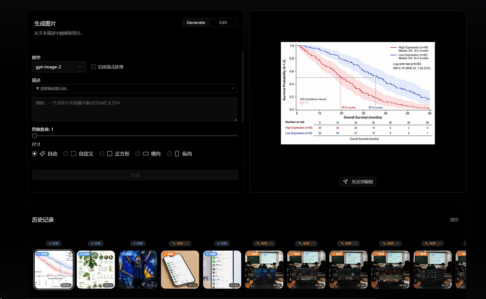
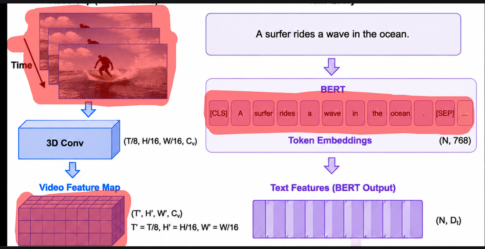
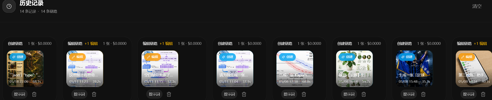
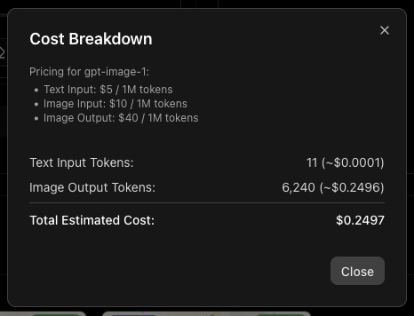

<!--
╔══════════════════════════════════════════════════════════════════════╗
║  DreamSeed 种梦计划 — AI创造者大赛  官方 README 模板                ║
║                                                                      ║
║  使用说明：                                                          ║
║  1. 将本模板放在参赛仓库根目录 README.md 的顶部                       ║
║  2. 头图使用 DreamField 官方公开活动图片地址                         ║
║  3. 请保留 DREAMFIELD_README_HEADER_START / END 标识                 ║
║  4. 分割线以下供创作者自由编写项目内容                               ║
╚══════════════════════════════════════════════════════════════════════╝
-->

<!-- DREAMFIELD_README_HEADER_START -->

<p align="center">
  <a href="https://www.dreamfield.top">
    
  </a>
</p>
<p align="right"><a href="./README_EN.md">英文旧版说明</a></p>
 https://vsllm.com


<!-- DREAMFIELD_README_HEADER_END -->

#  GPT 图像工坊

用文本生成图片，在已有图片上继续编辑，并通过场景模板、独立草稿与历史记录管理创作过程。支持 OpenAI GPT Image 模型与各类兼容图像接口（中转站等），模型列表按当前接口自动获取。

[快速开始](#快速开始) · [模板与提示词](#模板与提示词) · [模型与尺寸](#模型与尺寸) · [配置说明](#配置说明) · [开发与测试](#开发与测试)

## 功能概览

| 功能 | 当前支持 |
| --- | --- |
| 文本生成 | 描述主体、场景与风格，选择模型、数量、尺寸与质量；常用操作优先展示，高级参数按需展开 |
| 模型管理 | 按当前接口自动获取模型列表，可与内置选项混用；列表没有的模型可手动输入 |
| 多接口配置 | 保存多份服务商配置（最多 8 份），一键切换当前使用的密钥与接口 |
| 图片编辑 | 上传、拖放或粘贴图片；最多 10 张素材，第一张为底图，其余可作为参考 |
| 局部修改 | 在底图上涂抹选区，支持撤销笔画和上传 PNG 遮罩；提交时自动应用最新选区 |
| 场景模板 | 6 类、24 个模板，按生成或编辑模式筛选，支持搜索、填空、示例与实时预览 |
| 提示词工具 | 单独追加绘图约束、去重、复制和撤销；推荐参数由用户选择是否应用 |
| 请求反馈 | 等待计时、逐步预览、停止等待、失败重试；保留原提示词与已有结果 |
| 结果浏览 | 批量网格、单图放大、下载原图，以及将作品设为新的编辑底图 |
| 历史管理 | 搜索、类型筛选、创作分组、参数复用、记录导出与安全删除 |
| 草稿与存储 | 生成和编辑分别保存文字及参数；图片支持服务端文件存储或浏览器 IndexedDB |

## 快速开始

### 1. 安装并启动

需要 **Node.js 20.9 或更高版本**，推荐 Node.js 22，以及 npm。

```bash
git clone https://github.com/bpluo/api_GPT-image2.git
cd api_GPT-image2
npm ci
npm run dev
```

打开 [http://localhost:3000](http://localhost:3000)。

### 2. 连接图像服务

可以选择以下任意一种方式，也可以两者并存（未选择个人配置时自动使用服务端配置）。

**在页面配置个人接口**：点击右上角的 **API 设置**：

1. 点击 **添加配置**，填写配置名称（可选）、接口根地址和 API Key。使用兼容服务商时填写服务商根地址，例如 `https://example.com/v1`；只填域名会自动补上 `/v1`。地址留空时使用 OpenAI 官方接口。
2. 保存前可点击 **获取模型**，验证密钥和地址是否可用，并预览该接口提供的模型列表。
3. 点击 **使用** 切换当前生效的配置。可以保存最多 8 份配置，随时切换或删除。

配置保存在浏览器本地（localStorage），仅在生成或编辑时通过请求头转发给部署的服务端。旧版本保存的单份设置会自动迁移为一份配置。

**配置服务端默认接口**：把 [.env.example](.env.example) 复制为 `.env.local`，按需填写：

```dotenv
OPENAI_API_KEY=填写服务端密钥
OPENAI_API_BASE_URL=https://api.openai.com/v1
```

修改后重启开发服务。

自定义接口地址必须搭配自己的 API Key。个人与服务端两套配置分别解析，避免把服务端密钥发送到另一家接口。页面设置保存在当前浏览器，图像请求由部署的服务端转发。

### 3. 开始创作

1. 在 **生成图片** 中写下画面描述，或从 **场景模板** 选择一个起点。
2. 选择图片数量与画面比例；质量、格式等选项位于 **更多设置**。
3. 点击生成，或按 `Ctrl / ⌘ + Enter`。
4. 完成后可下载原图、放大查看，或点击 **作为底图编辑** 继续修改。

## 模板与提示词

模板库包含 **17 个生成模板、7 个编辑模板**：

| 分类 | 模板示例 |
| --- | --- |
| 科研绘图 | 方法架构、实验结果图版式、技术示意、研究摘要、对比网格、科研图修订 |
| 摄影与产品 | 产品主图、生活场景、食物静物、人像 |
| 插画创作 | 水彩风景、儿童绘本、水墨留白 |
| 海报与传播 | 电影感海报、音乐活动、信息知识卡片 |
| 界面视觉稿 | 移动端仪表盘、产品介绍页 |
| 图片修改 | 换背景、移除清理、风格配色、定点改字、延展画面 |

**完整模板**：选择场景，填写必填内容，检查实时预览，再点击 **填入提示词**。选填项可留空；示例只补空白项，保留已经输入的材料。生成模板可设置说明性标签语言，编辑模板默认保留原图语言。

**只补充规范**：已有提示词时，可以选择需要追加的绘图约束。重复规范会跳过，正文和生成参数保持原设置。

**推荐参数与撤销**：默认只更新提示词。勾选 **同时应用推荐参数** 后才调整界面列出的尺寸、质量和格式。应用后可以撤销；继续改写提示词后会收起旧撤销入口，避免覆盖新内容。

科研模板明确要求不编造实验数据、排名、误差线或统计结论。未提供数据时，结果图模板仅生成版式框架；正式定量图的数值、比例和统计标记应使用数据绘图工具生成并核对。

模板不会自动提交生成请求，提示词组装和规范去重也不额外调用模型接口。

完整目录与使用细节见 [模板和提示词说明](docs/prompt-workflow.md)。

## 图片编辑与结果管理

### 编辑素材和局部选区

- 支持 PNG、JPEG、WebP，单张不超过 50 MB，最多 10 张。
- 第一张图片为底图；其他图片可以作为参考，也可以点击 **设为底图** 调整顺序。
- 在 **局部修改** 中涂抹需要修改的区域，或上传与底图同尺寸的 PNG 遮罩；透明区域表示修改范围。
- 支持撤销笔画与清除选区，提交时自动生成并应用最新遮罩，无需单独保存。
- 增加参考图会保留当前底图选区；更换底图会重建选区，避免把旧遮罩套到新图片上。

原图、笔画和模板弹窗中尚未应用的填写内容仅保留在当前页面。刷新后需要重新添加素材；已经填入工作台的提示词与参数会自动保存。

### 等待、取消与部分成功

生成过程中会显示等待时间与保存状态。逐步预览目前仅在选择 `gpt-image-2`、每次 1 张、且接口支持流式响应时可用；生成和编辑分别保存自己的预览选项。

停止等待会中止客户端请求并尝试取消上游处理，已经产生的费用仍以服务商记录为准。失败后可以重试上一次请求，也可以修改提示词后重新提交。批量响应或流连接部分失败时，会保留收到的完整图片。

### 历史与费用

- 支持按提示词、模板、分类或模型搜索，以及按生成/编辑类型筛选。
- 点击作品查看图片；**详情** 中可以查看提示词、参数、模板来源和用量。
- **复用参数** 会把已有提示词与记录的参数带回对应表单，随后由用户提交。
- **导出记录** 下载 JSON 形式的历史、提示词和参数，不包含图片文件；需要保留的作品请另行下载原图。
- 删除只移除成功处理的图片与对应记录，失败项保留；仍被其他记录引用的图片会保留。
- **删除前确认** 可以随时开启或关闭；批量清空仍需确认。

费用按项目中的模型费率和服务商返回的用量估算，不能代替实际账单。未知单价或缺少用量时不显示伪造费用。

## 模型与尺寸

### 模型列表的获取方式

模型下拉列表由三部分合并而成，gpt-image 系列排在最前：

1. **自动获取**：工作台根据当前使用的 API 配置，请求服务商的 `/models` 接口获取可用模型。首次进入或切换配置后自动获取一次，也可以点击模型下拉旁的 **刷新** 手动更新。
2. **内置兜底**：接口不支持 `/models`（返回 404）时，保留内置选项，生成仍可正常使用。
3. **手动输入**：点击下拉旁的铅笔图标，直接输入任意模型名（Enter 确认、Esc 取消）。当前选中的模型即使不在列表中也会保留显示。

接口返回 HTML 而非 JSON 时（通常是接口地址填错），会提示检查地址。密钥错误会如实提示。获取失败不影响使用内置选项和手动输入。

内置兜底选项：

- GPT Image：`gpt-image-2`、`gpt-image-1.5`、`gpt-image-1`、`gpt-image-1-mini`。
- 兼容服务商别名：`gpt-image-2-高质量4k`、`agnes-image-2.5-flash`、`agnes-image-2.1-flash`。

默认选择 `gpt-image-2`。模型是否可用、支持哪些参数以及实际计费，由连接的服务商决定；别名不会自动对应到其他模型。未知模型的费用估算会直接跳过（显示"费用信息未提供"），不套用其他模型的单价。

### gpt-image-2 自定义尺寸校验

工作台对 `gpt-image-2` 的自定义尺寸执行以下校验：

| 项目 | 限制 |
| --- | --- |
| 宽度和高度 | 正整数，均为 16 的倍数 |
| 最大单边 | 3840 像素 |
| 最大长短边比 | 3:1 |
| 总像素 | 655,360 至 8,294,400 |
| 快捷尺寸 | 2K 方图、4K 横图、4K 竖图 |

切换模型、图片数量或输出格式时，界面会处理不兼容的选项。例如，当前 `gpt-image-2` 配置不提供透明背景，JPEG 也不支持透明通道。

## 配置说明

所有环境变量示例见 [.env.example](.env.example)。无需把真实 `.env.local` 提交到仓库。

| 变量 | 作用 |
| --- | --- |
| `OPENAI_API_KEY` | 可选的服务端默认密钥；也可在页面保存个人密钥 |
| `OPENAI_API_BASE_URL` | 服务端默认接口根地址，留空使用官方接口 |
| `APP_PASSWORD` | 校验生成、编辑和删除接口的访问密码 |
| `NEXT_PUBLIC_IMAGE_STORAGE_MODE` | `fs` 或 `indexeddb`；未指定时，本地默认 `fs`，Vercel 环境默认 `indexeddb` |
| `IMAGE_STORAGE_DIR` | 文件存储目录，默认当前项目的 `generated-images/` |
| `LEGACY_IMAGE_STORAGE_DIRS` | 用于读取历史图片的旧目录；Windows 用 `;` 分隔，其他平台使用系统路径分隔符 |
| `OPENAI_API_USER_AGENT` | 可选的上游请求 User-Agent，用于兼容中转站的 WAF 规则 |

修改配置后重启服务；修改 `NEXT_PUBLIC_*` 变量后，生产部署需要重新构建。

访问密码用于保护生成、编辑和删除操作。图片仍可通过其 URL 读取，当前没有独立用户账户或用户级文件隔离。`/api/models` 等接口与生成请求使用同一套凭据解析规则：调用者自定义的接口地址不能借用服务端密钥。

## 存储与部署

| 模式 | 图片位置 | 适用环境 |
| --- | --- | --- |
| `fs` | 服务端 `generated-images/` 或指定目录 | 本地运行、有持久磁盘的服务器 |
| `indexeddb` | 当前浏览器的 IndexedDB | Vercel 等无持久磁盘的部署 |

历史元数据、文字草稿、参数和多接口 API 配置保存在浏览器 LocalStorage 中。浏览器存储按协议、域名和端口隔离，换浏览器、设备或访问地址后不会自动共享；清理站点数据会删除本地历史、IndexedDB 图片以及已保存的 API 配置。

生产运行：

```bash
npm ci
npm run build
npm run start
```

使用 `fs` 时，应提供可写且持久的存储目录。迁移项目目录后，可通过 `LEGACY_IMAGE_STORAGE_DIRS` 指向旧图片目录；每条历史会继续使用它自己的存储模式读取图片。

## 开发与测试

项目基于 Next.js、React、TypeScript、Tailwind CSS 和 Dexie。当前有 **70 项自动化回归测试**，覆盖请求与鉴权、流式响应、部分成功、历史删除、存储恢复、模板流程，以及动态模型列表、多接口配置的存储迁移与切换。

```bash
npm test
npm run typecheck
npm run lint
npm run build
```

测试使用模拟响应，不调用真实付费图像服务。上述自动化检查与生产构建已通过；真实服务商的图像输出效果、桌面和窄屏浏览器交互仍需实测确认。动态模型获取与多配置切换已通过本地 dev server + 浏览器端到端验证（含真实中转站的 `/models` 接口）。

### 本地模拟验收

先运行 `npm run dev`，再在另一个终端执行：

```bash
node tests/fixture-server.cjs
```

打开 [http://127.0.0.1:3020](http://127.0.0.1:3020)。模拟服务只向开发服务转发页面读取请求，生成、编辑与删除均在本地模拟。

| 场景 | 操作 |
| --- | --- |
| 普通生成与编辑 | 在模拟页面正常操作，返回带模拟标记的测试图片 |
| 首次配置 | 使用 `?scenario=setup`，体验配置入口；只填写测试数据 |
| 访问密码 | 使用 `?scenario=password`，测试密码为 `test-only` |
| 浏览器图片存储 | 使用 `?scenario=indexeddb` |
| 请求失败 | 提示词包含“模拟失败” |
| 流式中断 | 启用逐步预览，并在提示词中包含“模拟中断” |
| 长时间等待与取消 | 提示词包含“等待测试” |

模拟服务默认连接开发端口 3000、监听端口 3020，可通过 `UX_APP_PORT` 和 `UX_FIXTURE_PORT` 调整。

维护文档：[体验与逻辑审查记录](docs/ux-review.md) · [模板与提示词说明](docs/prompt-workflow.md)

## 常见问题

**为什么填写密钥后仍无法生成？**

检查密钥、接口根地址与所选模型是否来自同一服务商。地址应是 `https://example.com/v1` 这样的根地址，不要填写到 `/images/generations`。只有个人密钥、没有地址时，会使用官方接口。可以在 API 设置中点击 **获取模型** 快速验证密钥和地址是否可用。

**模型下拉里没有我想要的模型？**

点击模型下拉旁的铅笔图标手动输入模型名；或点击 **刷新** 重新从当前接口获取列表。接口需要支持 `/models` 才能自动获取；不支持时仍可使用内置选项或手动输入。

**为什么历史图片找不到了？**

先确认访问地址和浏览器是否与原来相同。`fs` 模式检查图片目录与迁移配置；`indexeddb` 模式检查是否清理了站点数据。历史参数可以保留，但已删除的原图无法自动恢复。另外，本地开发时如果 dev server 异常重启过，可能出现图片请求全部失败——重启服务（必要时删除 `.next` 缓存）即可恢复，图片文件本身仍在磁盘上。

**为什么复制历史参数后，编辑按钮仍不可用？**

编辑模式还需要底图和有效的修改描述。复用参数不会自动重新添加刷新前的上传素材。

**为什么关闭了生成，还看到服务商扣费？**

取消是尽力中止请求。上游可能已经处理或完成任务，具体计费以服务商为准。

**API Key 保存在哪里，安全吗？**

个人配置保存在当前浏览器的 localStorage 中（明文），仅在本页生成、编辑时通过请求头转发给你自己部署的服务端。请勿在公用电脑上保存配置；部署到公网时建议设置 `APP_PASSWORD`，并使用 HTTPS。

## 界面参考

以下截图来自旧版本，展示功能背景；当前布局、模板入口与操作文案以运行中的页面为准。

<details>
<summary>查看旧版功能截图</summary>

<p align="center"></p>
<p align="center"></p>
<p align="center"></p>
<p align="center"></p>

</details>

## 反馈与许可

使用问题和改进建议可提交至 [GitHub Issues](https://github.com/bpluo/api_GPT-image2/issues)。项目采用 [MIT 许可证](LICENSE)。
